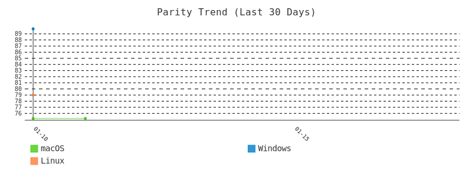
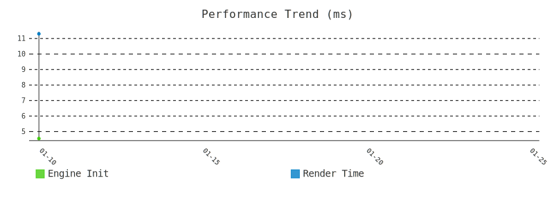
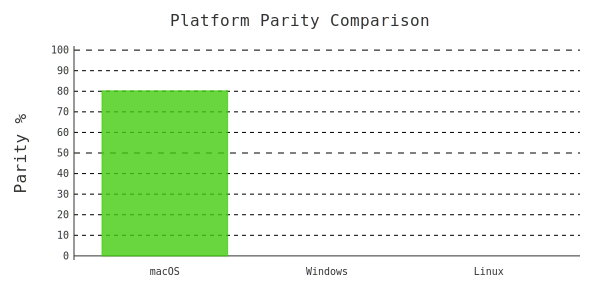

<p align="center">
  
</p>

<h1 align="center">HiWave</h1>

<p align="center">
  <strong>Focus. Flow. Freedom.</strong><br>
  A privacy-first browser built from scratch in Rust — designed to help you browse less, not more.
</p>

<p align="center">
  <a href="#platform-status">Status</a> •
  <a href="#what-is-hiwave">What is HiWave?</a> •
  <a href="#platforms">Platforms</a> •
  <a href="#quick-start">Quick Start</a> •
  <a href="#contributing">Contributing</a> •
  <a href="#support-the-project">Support</a>
</p>

<p align="center">
  
  
  
</p>

<p align="center">
  <a href="https://github.com/hiwavebrowser/hiwave/actions/workflows/parity-unified.yml">
    
  </a>
</p>

<p align="center">
  
  
</p>

---

## Platform Status

| Platform | Build | Parity | Tests | Performance |
|----------|-------|--------|-------|-------------|
| macOS |  |  |  |  |
| Windows |  |  |  |  |
| Linux |  |  |  |  |

<details>
<summary>Parity Trend (click to expand)</summary>



</details>

<details>
<summary>Performance Trend</summary>



</details>

<details>
<summary>Platform Comparison</summary>



</details>

<details>
<summary>Code Churn Analysis</summary>

View the interactive [**Churn Report Dashboard**](churn-reports/dashboard.html) to see:
- File modification frequency across all platforms
- Line range hotspots indicating areas of active development
- Cross-platform file synchronization patterns
- Divergent development patterns

*Updated weekly via GitHub Actions*

</details>

---

## Visual Parity Testing

RustKit engine is tested against Chrome 120 baselines using **triple verification**:

| Verification | Description | Weight |
|--------------|-------------|--------|
| **Pixel Diff** | Direct pixel comparison | Primary |
| **Layout Rects** | Element positioning accuracy | Secondary |
| **Computed Styles** | CSS property matching | Diagnostic |

### Test Cases (23 total)

| Category | Count | Cases |
|----------|-------|-------|
| Built-ins | 5 | `new_tab`, `about`, `settings`, `chrome_rustkit`, `shelf` |
| Websuite | 8 | `article-typography`, `card-grid`, `css-selectors`, `flex-positioning`, `form-elements`, `gradient-backgrounds`, `image-gallery`, `sticky-scroll` |
| Micro-tests | 10 | `backgrounds`, `bg-solid`, `combinators`, `form-controls`, `gradients`, `images-intrinsic`, `pseudo-classes`, `rounded-corners`, `specificity` |

### Running Parity Tests

```bash
# Run all tests with 3 iterations (macOS)
cd hiwave-macos
python3 scripts/parity_swarm.py --scope all --iterations 3

# Run builtins only with 2 parallel jobs (Windows)
cd hiwave-windows
python scripts/parity_swarm.py --scope builtins --jobs 2

# Run with Xvfb (Linux)
cd hiwave-linux
xvfb-run python3 scripts/parity_swarm.py --scope all
```

*Parity scores updated daily via [GitHub Actions](https://github.com/hiwavebrowser/hiwave/actions/workflows/parity-unified.yml)*

---

## What is HiWave?

**HiWave** is a new kind of browser — one that respects your attention and privacy.

While most browsers are designed to keep you scrolling endlessly, HiWave actively helps you:
- 🧹 **Close tabs** with The Shelf — park tabs that fade with age
- 🛡️ **Block trackers** at the engine level — no extensions needed
- 🗃️ **Separate contexts** with Workspaces — work stays work, personal stays personal
- ⌨️ **Navigate fast** with keyboard-first design

### Built Different

Unlike Chrome, Firefox, or Safari, **HiWave runs on RustKit** — our own browser engine written from scratch in Rust (In development...). The currenty fully working browser uses system renderers. Everything is fully built in Rust. 

---

## Platforms

This repository is the umbrella project containing all HiWave components:

| Platform | Repository | Status |
|----------|------------|--------|
| 🪟 **Windows** | [hiwave-windows](./hiwave-windows) | Alpha — RustKit engine |
| 🍎 **macOS** | [hiwave-macos](./hiwave-macos) | Alpha — RustKit engine |
| 🐧 **Linux** | [hiwave-linux](./hiwave-linux) | Alpha — RustKit engine |

Each platform directory contains its own README with platform-specific build instructions.

---

## Quick Start

### Clone with Submodules

```bash
git clone --recursive https://github.com/hiwavebrowser/hiwave.git
cd hiwave
```

### Windows
```powershell
cd hiwave-windows
.\scripts\run-native-win32.ps1  # 100% RustKit (default)
```

### macOS
```bash
cd hiwave-macos
./scripts/run-rustkit.sh  # RustKit for content (default)
```

### Linux
```bash
cd hiwave-linux
cargo run --release
```

See each platform's README for detailed build instructions and run modes.

---

## Contributing

**We'd love your help!** HiWave is an ambitious project and there's plenty to do.

### 🐛 Found a Bug?

[**Open an Issue**](https://github.com/hiwavebrowser/hiwave/issues/new?labels=bug) — Tell us what went wrong. Include:
- What you expected vs. what happened
- Steps to reproduce
- Your OS and HiWave version

### 💡 Have an Idea?

[**Submit a Feature Request**](https://github.com/hiwavebrowser/hiwave/issues/new?labels=enhancement) — We want to hear it! Great ideas come from users.

### 🔧 Want to Code?

1. Fork the repo
2. Check the issues labeled [`good first issue`](https://github.com/hiwavebrowser/hiwave/issues?q=is%3Aissue+is%3Aopen+label%3A%22good+first+issue%22)
3. Submit a PR!

See [CONTRIBUTING.md](./hiwave-windows/CONTRIBUTING.md) for development setup and guidelines.

### 📖 Improve the Docs

Documentation PRs are always welcome. If something confused you, it probably confuses others too.

---

## Support the Project

<p align="center">
  <a href="https://ko-fi.com/hiwavebrowser">
    
  </a>
</p>

**HiWave is free, open source, and ad-free.** We don't track you. We don't sell your data. We never will.

Building a browser from scratch is a massive undertaking. If HiWave helps you focus better or just makes you smile, consider buying us a coffee:

<p align="center">
  <strong>☕ <a href="https://ko-fi.com/hiwavebrowser">ko-fi.com/hiwavebrowser</a></strong>
</p>

Your support helps cover:
- ⏰ Development time (a LOT of it)
- 🖥️ Infrastructure and testing
- 🚀 Future features like HiWave Sync

Every coffee counts. Thank you! 💜

---

## Project Structure

```
hiwave/
├── hiwave-windows/     # Windows app (RustKit engine)
├── hiwave-macos/       # macOS app (RustKit engine)
├── hiwave-linux/       # Linux app (RustKit engine)
├── churn-report/       # Code churn analysis tool (submodule)
├── churn-reports/      # Generated churn analysis reports
├── community/          # (coming soon) ways to help development
└── README.md           # You are here
```

---

## License

HiWave is licensed under the [Mozilla Public License 2.0](./hiwave-windows/LICENSE).

- ✅ Free to use, modify, and distribute
- ✅ Build commercial products
- ⚠️ Changes to HiWave's files must be shared under MPL-2.0

For commercial licensing options, see [COMMERCIAL-LICENSE.md](./hiwave-windows/COMMERCIAL-LICENSE.md).

---

<p align="center">
  <strong>Built with 💜 for people who want to focus.</strong>
</p>

<p align="center">
  <a href="https://www.hiwavebrowser.com">Website</a> •
  <a href="https://github.com/hiwavebrowser/hiwave/issues">Issues</a> •
  <a href="https://ko-fi.com/hiwavebrowser">Support Us</a> •
  <a href="https://twitter.com/hiwavebrowser">Twitter</a>
</p>

